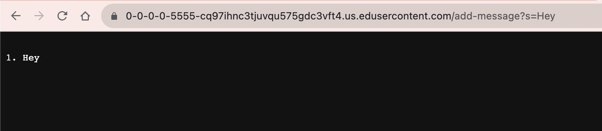
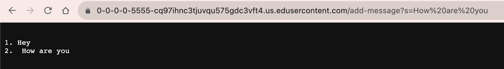

Part 1:
~~~

import java.io.IOException;
import java.net.URI;

class Handler implements URLHandler {
    // The one bit of state on the server: a number that will be manipulated by
    // various requests.
    int msgCount = 0;
    String str = "";

    public String handleRequest(URI url) {
        if (url.getPath().contains("/add-message")) {
            String[] parameters = url.getQuery().split("=");
            if (parameters[0].equals("s")) {
                System.out.println(parameters[1]);
                if (parameters[1].contains("+")) {
                    String[] words = parameters[1].split("\\+");
                    String phrase = "";
                    for (String word: words) {
                        phrase = phrase + " " + word;
                    }
                    msgCount++;
                    String temp = String.format("\n%d. %s", msgCount, phrase);
                    str = str + temp;
                    return str;
                }
                else {
                    msgCount++;
                    String temp = String.format("\n%d. %s", msgCount, parameters[1]);
                    str = str + temp;
                    return str;
                }
        }
        }
        return "404 Not Found!";
    }
}

class StringServer {
    public static void main(String[] args) throws IOException {
        if(args.length == 0){
            System.out.println("Missing port number! Try any number between 1024 to 49151");
            return;
        }

        int port = Integer.parseInt(args[0]);

        Server.start(port, new Handler());
    }
}
~~~

1. After starting the server which calls the main method of the stringserver.java file, when typing into the searchbar
   the /add-message?s=Hey portion of the querry, it then goes into the handlerequest method, which takes specific parts of the URL and
   checks for different markers and then adds to our string that is displayed on screen. The start server and handle methods of the server
   are called as well.
2. The main argument that is being used across this class is the URI that is being used as the argument for the handleRequest method.
   For the server side of things the port number argument which is passed through via the args[] of the main method is also used.
3. If the URI is passed through with different markers, like for example something other than /add-messages, then the method doesn't do
   much at all and instead jsut displays "404 not found" instead of doing anything else.

1. Once again the methods for the server are called using the main method and server methods of the server class and stringServer class.
   Which after a new URI is passed into the searchbar the handleRequest method is called and it starts printing out the strings to the
   server.
2. The main arguemnts are the URI and the port number which is passed in through the args[] of the main method.
3. The URI this time is obviously different so now the handleRequest method goes into a new sequence of breaking down a word with spaces
   into a single string without the default \\+ symbols in between everything.

Part 2:

