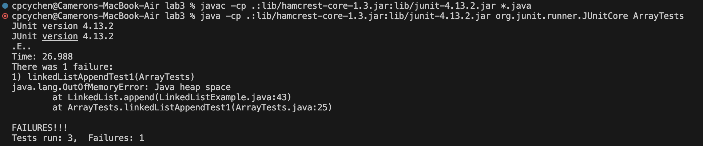
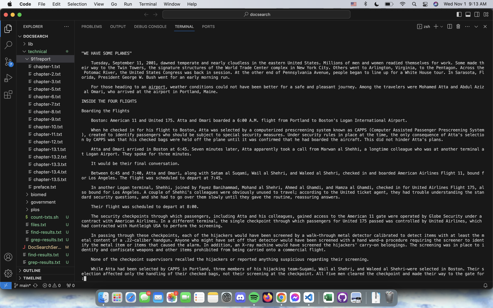
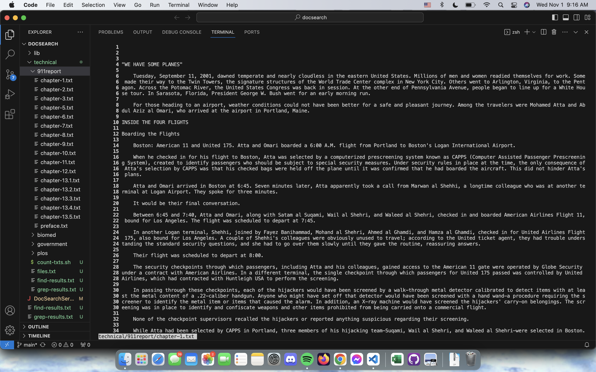
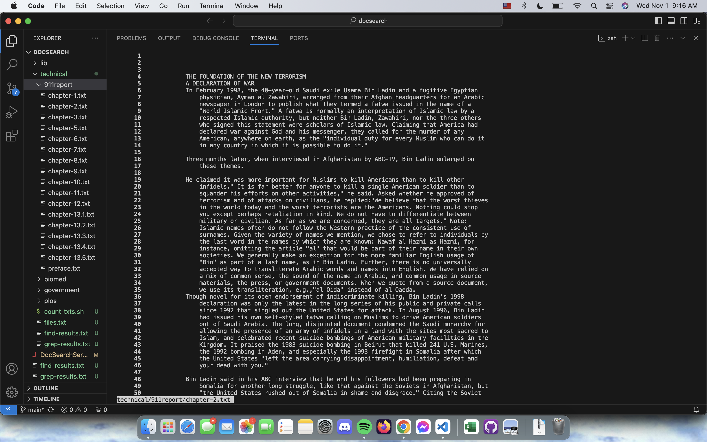
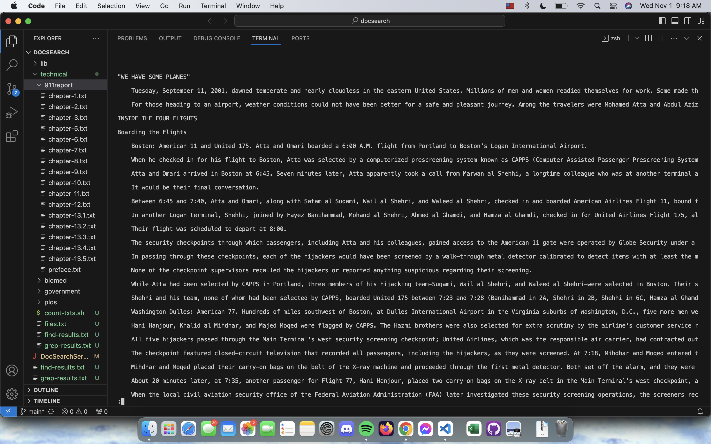
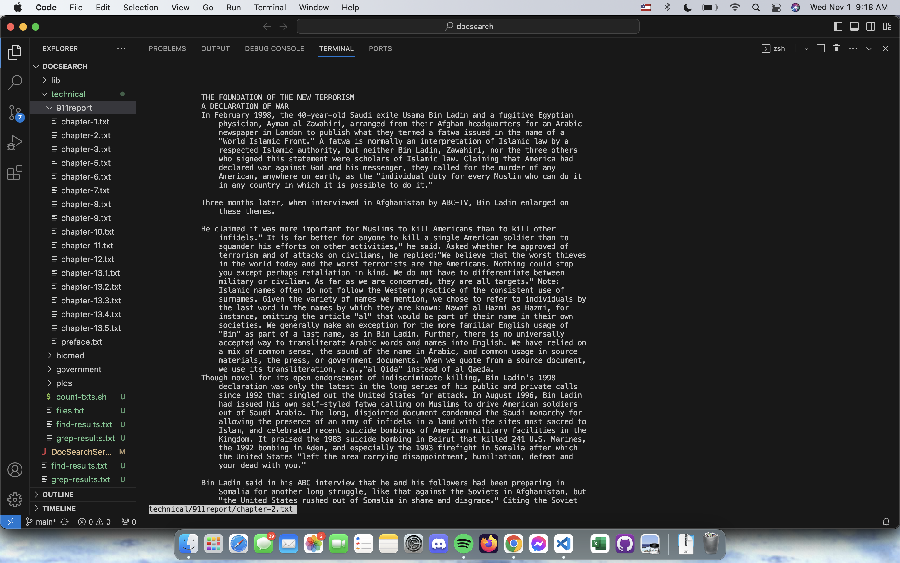
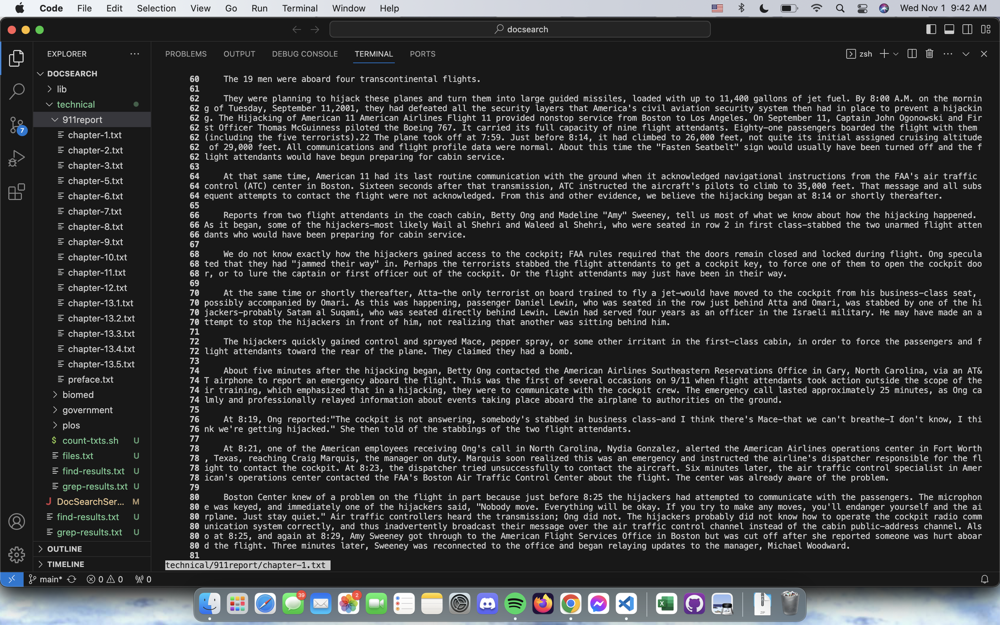
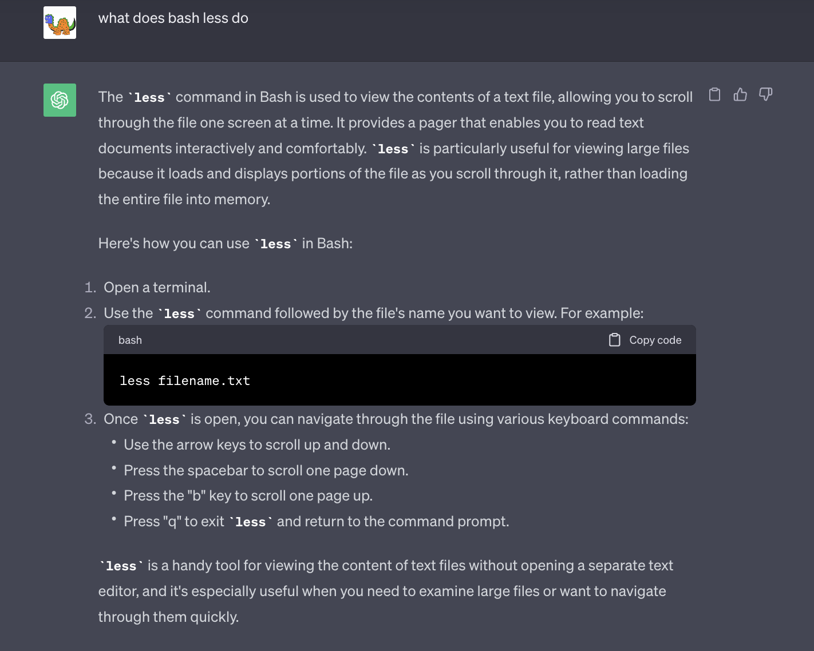
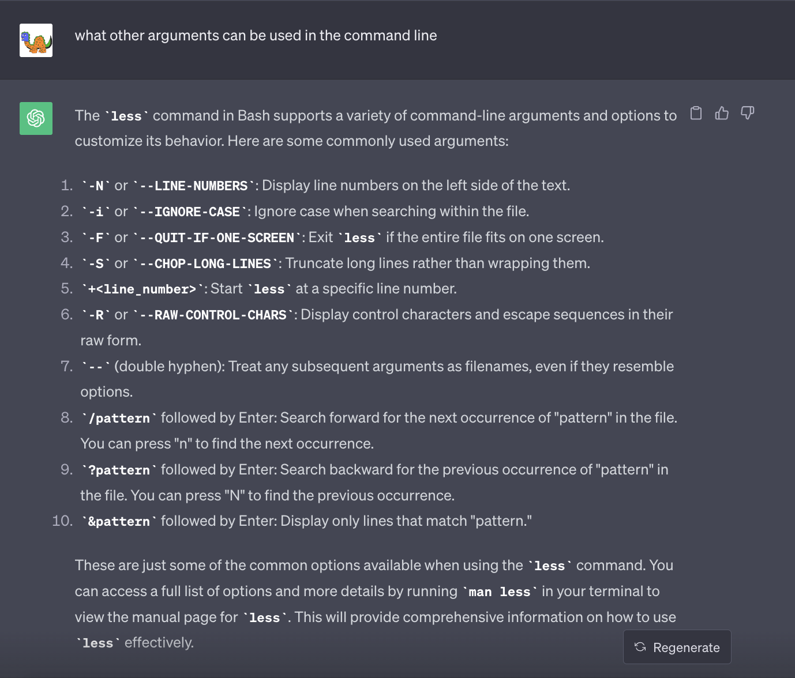
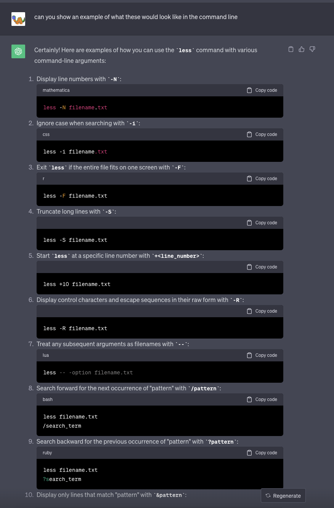

Part 1:
Test that shows failure
~~~
  @Test 
  public void linkedListAppendTest1() {
    LinkedList linklist = new LinkedList();
    linklist.prepend(5);
    linklist.prepend(5);
    linklist.prepend(5);
    linklist.append(10);
    String listString = linklist.toString();
    String expected = "5 5 5 10";
    assertEquals(expected, listString);
  }
~~~
Test that succeeds 
~~~
  @Test
  public void linkedListAppendTest2() {
    LinkedList linklist = new LinkedList();
    linklist.append(5);
    linklist.append(10);
    String listString = linklist.toString();
    String expected = "5 10 ";
    assertEquals(expected, listString);
    }
~~~
Symptoms

Original 
~~~
public void append(int value) {
        if(this.root == null) {
            this.root = new Node(value, null);
            return;
        }
        // If it's just one element, add if after that one
        Node n = this.root;
        if(n.next == null) {
            n.next = new Node(value, null);
            return;
        }
        // Otherwise, loop until the end and add at the end with a null
        while(n.next != null) {
            n = n.next;
            n.next = new Node(value, null);
        }
    }
~~~
My version without bugs:
~~~
public void append(int value) {
    if (this.root == null) {
        this.root = new Node(value, null);
        return;
    }

    Node n = this.root;
    while (n.next != null) {
        n = n.next;
    }

    n.next = new Node(value, null);
}
~~~
to fix the bugs I took away the siuation with the if n.next is null check and baked it into the while loop, and then took the line that makes the new node out of the while loop 
so that the while loop does not just keep making more and more nodes to churn through and eventually will end. The while loop is now just an iterator to get through the linkedlist to the end
so that it can add one more node to the last one. 

Part 2:
~~~
cpcychen@Camerons-MacBook-Air docsearch % less technical/911report/chapter-1.txt technical/911report/chapter-2.txt
~~~

This was my first example of the basic call of less with just one file as the only argumnet. This reuslted in the terminal going to a new page ass seen in the photo where you could navigate
around the file and raed its contents.
~~~
cpcychen@Camerons-MacBook-Air docsearch % less technical/911report/chapter-2.txt technical/911report/chapter-1.txt
~~~

This was the second exmaple of the basic call on a new file. 
~~~
cpcychen@Camerons-MacBook-Air docsearch % less -N technical/911report/chapter-1.txt
~~~

When typing -N as an argument before the path for the text file, the terminal then has all the line numbers on the side of the screen.
~~~
cpcychen@Camerons-MacBook-Air docsearch % less -N technical/911report/chapter-2.txt
~~~

Same as the last image but with the second file, seeing how the line numbers deal with wrapped lines. 
~~~
cpcychen@Camerons-MacBook-Air docsearch % less -S technical/911report/chapter-1.txt 
~~~

The -S was one of my favorite arguments for this command as it just chops off the end of all lines that are longer than the screen. 
~~~
cpcychen@Camerons-MacBook-Air docsearch % less -S technical/911report/chapter-2.txt
~~~

Seeing what -S does when lines don't wrap around or run off of the screen. Like with this text file nothing happens when you add this argument as there isnt anything to truncate.
~~~
cpcychen@Camerons-MacBook-Air docsearch % less +30 -N technical/911report/chapter-1.txt
~~~

The next argument that was added into the command line was adding a +linenumber to the command. What this does is it starts your page on the 30th line of the txt file. You can still scroll 
up though and see whats going on before line 30. 
~~~
cpcychen@Camerons-MacBook-Air docsearch % less +30 -N technical/911report/chapter-2.txt
~~~

Combined the +line number with the -N count line numbers to see what was going on. As expected it started my page right at 30..

heres what I typed into my terminal for these commands:
~~~
cpcychen@Camerons-MacBook-Air docsearch % less technical/911report/chapter-1.txt
cpcychen@Camerons-MacBook-Air docsearch % less technical/911report/chapter-1.txt
cpcychen@Camerons-MacBook-Air docsearch % less technical/911report/chapter-2.txt
cpcychen@Camerons-MacBook-Air docsearch % less technical/911report/chapter-1.txt -N
cpcychen@Camerons-MacBook-Air docsearch % less -N technical/911report/chapter-1.txt
cpcychen@Camerons-MacBook-Air docsearch % less -N technical/911report/chapter-2.txt
cpcychen@Camerons-MacBook-Air docsearch % less -S technical/9aa/report/chapter-1.txt
technical/9aa/report/chapter-1.txt: No such file or directory
cpcychen@Camerons-MacBook-Air docsearch % less -S technical/911report/chapter-1.txt 
cpcychen@Camerons-MacBook-Air docsearch % less -S technical/911report/chapter21.txt
technical/911report/chapter21.txt: No such file or directory
cpcychen@Camerons-MacBook-Air docsearch % less -S technical/911report/chapter-2.txt
cpcychen@Camerons-MacBook-Air docsearch % less + 30 technical/911report/chapter-1.txt
+: No such file or directory
30: No such file or directory
technical/911report/chapter-1.txt  (press RETURN)
~~~

GPT QUESTIONS:

