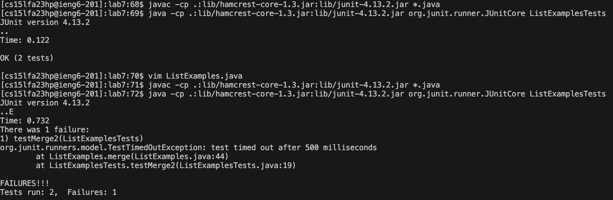
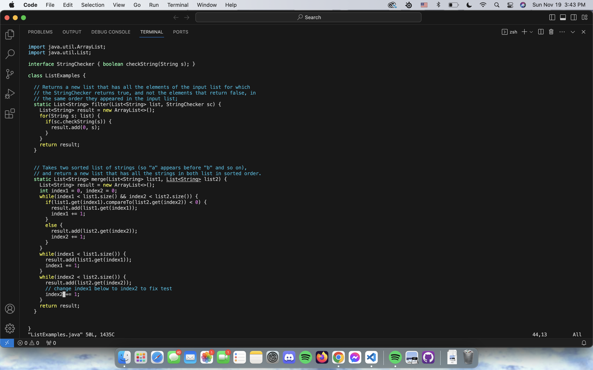
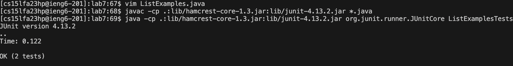
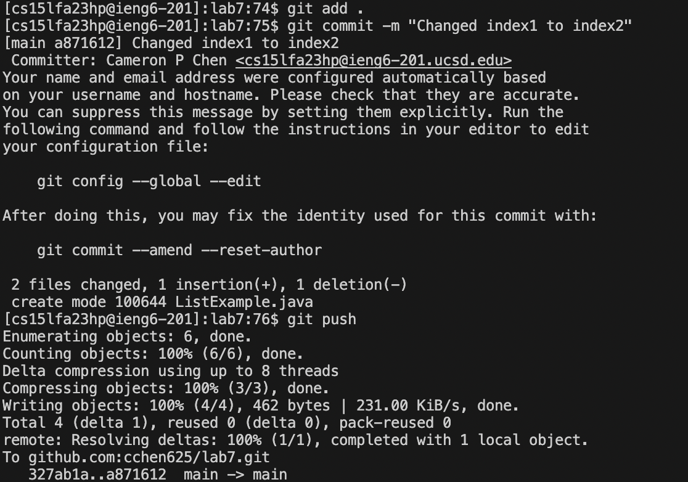

1. Keys pressed to log into ieng6:
typed:
~~~
ssh<space>cs15lfa23hp<shift+2>ieng6.ucsd.edu<enter>
~~~
Summary: using the ssh command to log into the ieng6 computers. Skipped through the login process because of keys.

2. Cloning the forked repository:
typed:
~~~
git<space>clone<space><command + v><enter>
~~~
note: the url was already copied to my clipboard before the task was started, it was copied directly from my forked repository.
Summary: Using git clone command to clone the repository to the ieng6 computer. 

3. Running to show failed tests:
typed:
~~~
cd<space>lab7<enter><up><up><up><up><up><up><enter><up><up><up><up><up><up><enter>
~~~
note: I had already used the compile command 5 times ago, so pressing up scrolled through the history, then in the call for the java command I had to do the same number
of up presses as there was one extra in the list from the prior javac run.
Summary: first I used cd in order to change my currend directory to the lab7 directory that had just been cloned. then I scrolled up into my history and called the java compile and java
run commands in order to compile and run the files that were being tested. 

4. Fixing the code:
typed:
~~~
vim<space>ListExamples.java<down (held)><right (held)><delete>2<escape><shift + ;>wq<enter>
~~~
note: down was held till the line that needed to be editted and then right was held till hovering over the space after the 1 in index1.
Summary: called vim and then inside of vim simply scrolled and edited the test document using the vim insert mode, saved and quitted in order to quit out of vim without losing my changes
that I had just made to the code.

5. Running the tests again:
typed:
~~~
<up><up><up><enter><up><up><up><enter>
~~~
note: once again I pressed up for the correct command in the history, now since I had just called the javac 3 lines prior I only had to press 3 ups for each call of javac and then java.
Summary: Again I called the java compile and java commands in order to recomiple the new editted file and then run the test file, that was the tests would show passes now that
things have been editted.

6. Pushing to github:
typed:
~~~
git<space>add<space>.<enter>git<space>commit<space><shift + '><shift + c>hanged<space>index1<space>to<space>index2<shift + '><enter>git<space>push<enter>
~~~
Summary: Used git add first to start preparing my push, this took the whole working directory and staged it for a commit. Then I used the git commit method to make a commit with the
staged file and then added the commit message that would be shown once I push it back to the repository. Lastly I used git push to make it offical and push my edits and commit message
back to the repository where I had forked it from. 

