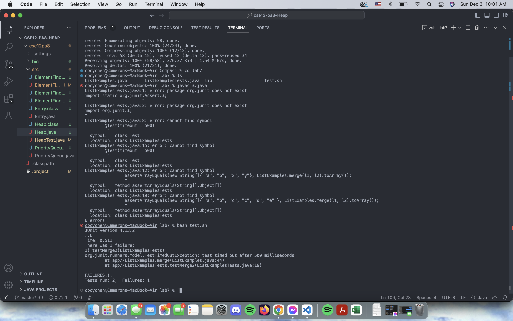
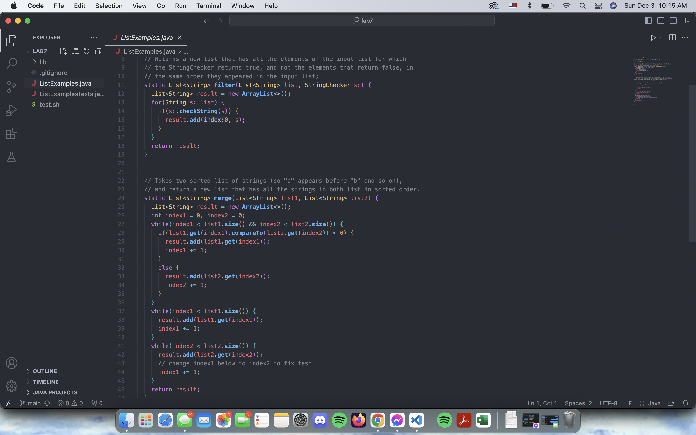
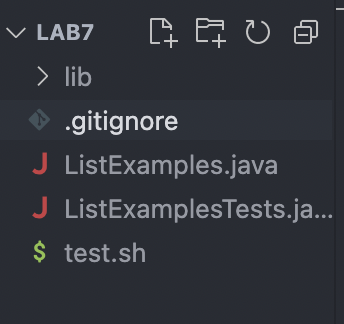
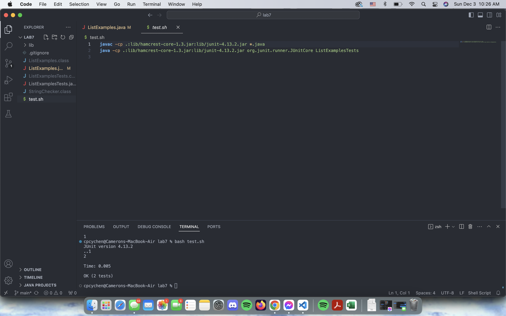
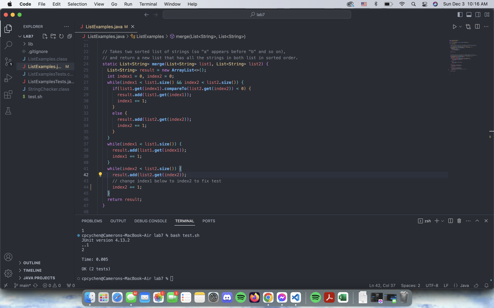
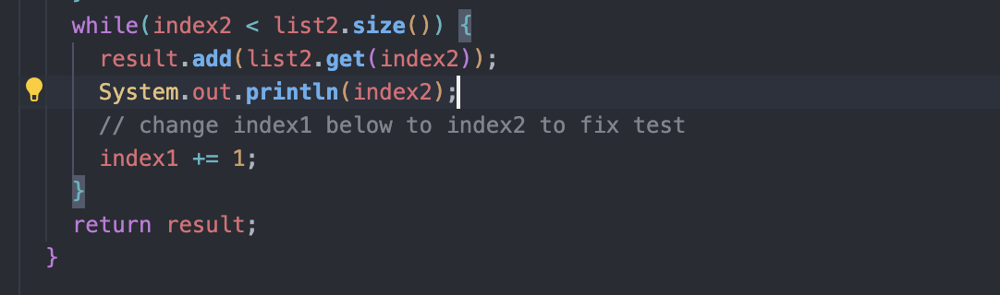

1. Dear TA, I'm currently getting several error messages from junit when running my tests, as they aren't passing anything. My project has to do with a sorting algorithm for
Lists and its really frustrating how its not all working, anything you can do to help me out?

3. Of course! try putting some print statements to find out specifically where things are going wrong. It looks like your failing a testcase where your going into a infinite loop
somewhere along the line, would you mind trying to put those print statements in the while loops and see what the symptoms of the bug are.

4. Thank you so much, when I put the print statement in the last while loop I saw that index2 was never changing and so the condition for the while loop to terminate never would
be reached, so I looked into my code and saw I was incrementing the wrong variable! Thanks for your help. Here's what I added to see the bug
and my code and directory afterwards!

5. Glad I was able to help out! Alwyas check those while loops haha!

REFLECTION:
The most important thing to me that I learned in the second half of the quarter was jdb, being able to actually use a debugger to find holes in my code was really helpful and now that I understand the concept of breakpoints I'm able to use other debuggers like the one baked into visual studio code. Jdb is kind of difficult to use and being able to stopat certian lines and use locals to see everywhere that I'm doing something wrong is really helpful for me to fix tricky bugs that would otherwise take me a long time to find. 
